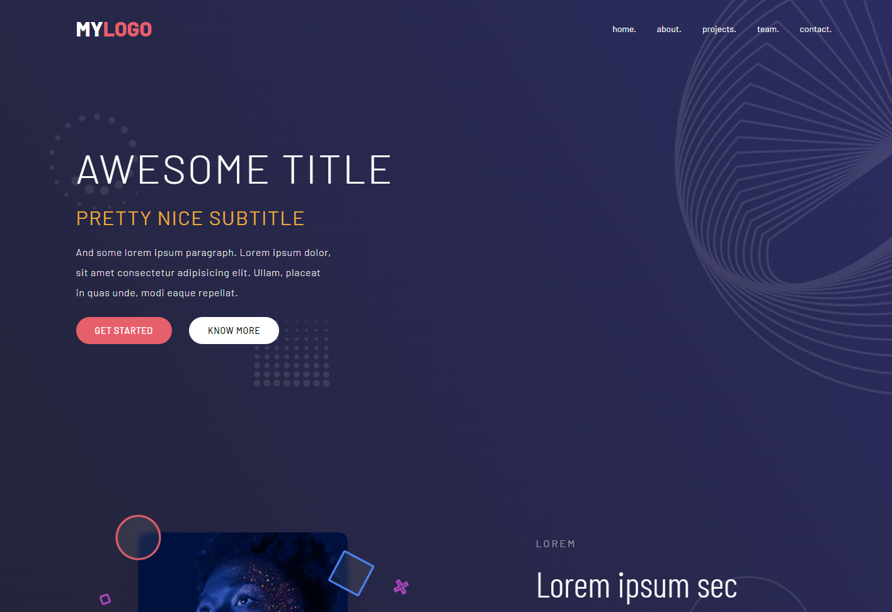
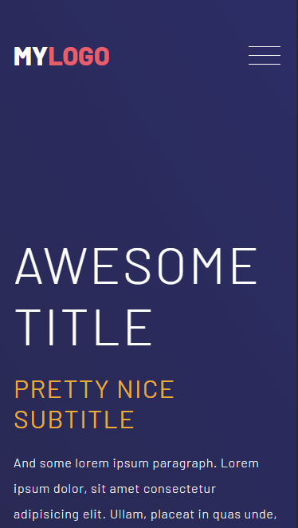

# Ultimate Exercise

A CSS exercise done during my training at [BeCode](https://becode.org/all-trainings/pedagogical-framework-junior-developer/).

## The Goal

The project was to create a responsive web page using everything we learned so far.

- SASS
- Media queries
- Background images
- before and after content

## What does it look like ?

Check the result ➡️ [here](https://dystrima.github.io/Ultimate-exercise/) ⬅️

